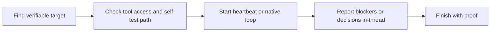
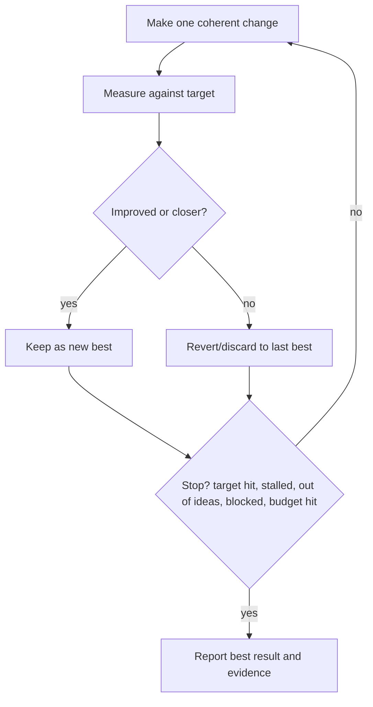

# Use Loop

Use this skill as the default execution shape for implementation and product goals.

Your job is to run one verifiable loop for the current task. Do not rely on intention alone. Look for a built-in `/loop` tool: Claude, Cursor, and Devin have one. If you are Codex, use heartbeat automations. Report status, blockers, questions, and final proof clearly.

## Default Loop Policy

Default to a loop for implementation, product, QA, cleanup, refactor, eval, performance, and verification work. Do not treat loops as a rare special mode.

A good loop has these properties:

- The target can be verified by a command, test, metric, browser check, reviewer, eval, validation count, or explicit artifact inspection.
- The agent can access or request the tools, credentials, runtime, browser/app surface, repo state, or external service needed to self-test against that target.
- The verifier is stable enough to be the source of truth for the loop.
- Each attempt can be kept, reverted, or summarized without losing control of the worktree.
- There is a clear stop condition.
- There is a decision gate for product judgment, destructive actions, publishing, deployment, credential use, or ambiguous tradeoffs.

If one property is missing, preserve the loop shape and surface the exact blocker. For example: "goal is clear, but I cannot self-test because staging credentials are missing." Do not silently downgrade to an unverifiable one-shot.

## Setup Flow

Use this order before iterating:

1. Identify the goal and verifiable target.
2. Identify tool access and ability to self-test against that target.
3. Establish the baseline with the verifier when possible.
4. Start an actual continuation loop using the agent-specific mechanism below.
5. Report in-thread only for blockers, critical questions, surprising results, or final completion.
6. Repeat until the goal is reached or a stop condition triggers.

The tool-access check is mandatory. Look for the same things `self-test` requires: test configs, build scripts, app launch paths, browser/Electron harnesses, Computer Use/browser access, API endpoints, credentials, fixtures, existing specs, and the loop continuation tool. If the agent cannot reach the highest-signal affected surface or cannot start the required continuation mechanism, stop and report the blocker instead of silently using weaker proof.

## Loop Diagrams

Use these diagrams as the mental model for the workflow.

End-to-end loop:



One turn of the loop:



## Loop Contract

Before starting work, write the loop contract in the current thread or task prompt:

```text
Loop: <name>
Goal: <specific outcome>
Target: <metric, tests, eval, QA check, review gate, validation count>
Verifier: <exact command/tool/surface and expected result>
Tool access: <available tools, credentials, runtime, browser/app/API access>
Self-test path: <how the agent will prove the goal on the highest-signal surface>
Baseline: <current score/state, or "establish first">
Iteration rule: <what may change per attempt>
Keep/revert rule: <when to preserve a change; when to revert to last best>
Stop conditions: <target hit, no gains after N tries, out of ideas, blocked, budget hit>
Budget: <max attempts/time/tokens>
State ledger: <where attempts/results/evidence are recorded>
Continuation: <Codex heartbeat automation, native /loop, or blocker>
Decision gate: <decisions that require the caller>
Report: <when to write in-thread: start, surprise, blocker, completion>
Closeout: <simplify, self-test, autoreview requirements>
Return: <final evidence, best result, attempts, residual risk>
```

If any field is unknown and materially affects safety or success, clarify before running the loop.

## State Machine

Use this loop shape:

1. Establish or confirm the baseline.
2. Make one coherent change.
3. Measure against the target using the declared self-test path.
4. If improved or closer to the target, keep it as the new best.
5. If not improved, revert or discard the attempt and return to the last best state.
6. Record the attempt in the ledger.
7. Decide whether to stop:
   - target hit,
   - no improvement after the configured patience,
   - out of ideas,
   - blocked or unsure,
   - budget hit.
8. If not stopping, run the next attempt.
9. When stopping, report the best state and evidence.

The target is the source of truth. Do not weaken or change the target during the loop unless the decision gate approves it.

## Agent-Specific Execution

First determine the loop mechanism. If you are Claude, Cursor, or Devin, use the built-in `/loop` tool. If you are Codex, expose the automation tool and create a heartbeat automation for the current thread after the loop contract is explicit and before implementation attempts begin. Use the heartbeat to wake this thread and continue the state machine until a stop condition is met.

Use this compact Codex heartbeat shape:

```text
Title: loop: <goal>
Cadence: every 3 minutes by default.
Wake message: Continue the loop toward <goal>. Check the latest state and verifier, take the next step, update the ledger, and report only blockers, critical decisions, surprising results, or final completion.
```

Do not repeat the full loop contract, history, or verifier details in every heartbeat. The thread already has context; the automation only needs to wake the loop and point at the current goal.

Set up the heartbeat by default before iterating. When the task reaches final proof, close or cancel the loop using the available automation controls. If the automation tool is unavailable, report that as a loop blocker instead of pretending the loop is durable.

If your environment has a native `/loop` command, such as Claude or Cursor-style agents, invoke it yourself after the target, verifier, tool access, and self-test path are explicit:

```text
/loop until <metric / tests / eval / QA check> hits <target>.
Treat <verifier> as the source of truth and do not change it while running.
Before each attempt, confirm tool access needed for <self-test path>.
Make one coherent change, measure, keep improvements, and revert non-improvements.
Stop early if progress stalls, ideas run out, access is missing, or you are blocked/unsure.
Report only for blockers, critical decisions, surprising results, and final completion.
```

## State Ledger

Maintain a durable ledger for the loop. Use an existing issue, plan, checklist, thread summary, or a workspace file when appropriate.

Record each attempt with:

- attempt number,
- change made,
- verifier result,
- keep/revert decision,
- evidence link, command output summary, screenshot, score, or file path,
- next idea or blocker.

Do not rely on chat history alone for long-running loops.

## Compact Loop State

Keep heartbeat state short enough to survive many wakeups. Store details in the ledger or artifacts; put only the current control state in the heartbeat. For worker loops, the wake message should usually be just: "continue the loop toward the goal; check the latest verifier; report blockers or final proof."

Use this shape:

```text
Goal: <one-line target>
Verifier: <latest command/surface/result>
Best state: <current kept attempt or baseline>
Attempts: <kept/reverted count>
Blocker: <none or exact blocker>
Next action: <single next step>
Stop when: <target/stall/blocker/budget condition>
Artifacts: <ledger, patch, screenshot, run, or PR links>
```

## Reporting Protocol

Keep reports short and structured:

```text
Status: <running | blocked | done>
Current best: <best result so far>
Latest verifier: <command/surface/result>
Attempts: <kept/reverted count>
Blocker/question: <only if needed>
Next action: <what happens next>
```

## Loop Types

Common loop shapes:

- **Product goal loop:** identify the product goal, identify or request tool access for `self-test` verification, implement, self-test, and iterate until the goal is verified or blocked.
- **Tests loop:** write or expose failing test, implement, run test suite, keep only green progress.
- **Autoreview loop:** run structured autoreview, verify accepted findings against source, fix, rerun focused proof, then rerun autoreview until no accepted/actionable findings remain.
- **QA loop:** run browser/app QA, inspect screenshots or UI state, fix, repeat until the real surface passes.
- **Eval loop:** run eval or benchmark, keep only score improvements that do not break guardrails.
- **Performance loop:** measure baseline, change, compare p95/benchmark, keep only meaningful improvement.
- **Cleanup loop:** validate rows/files/items, fix batches, repeat until failing count reaches zero.
- **Research loop:** gather evidence in passes, stop when ranked findings have citations and the highest-risk claims are spot-checked.

## Closeout

Do not call a loop complete just because it stopped. Close it with:

- final best result,
- verifier evidence,
- attempts kept and reverted,
- stop reason,
- residual risks,
- decisions still needed.

For implementation loops, run the normal closeout gates:

1. `simplify` on the changed files.
2. `self-test` on the real affected surface.
3. `autoreview` as the structured review gate.
4. Fix accepted findings, rerun focused proof, and rerun `autoreview` until clean.
5. Commit only when verification is sufficient and the user requested or expects a commit.
